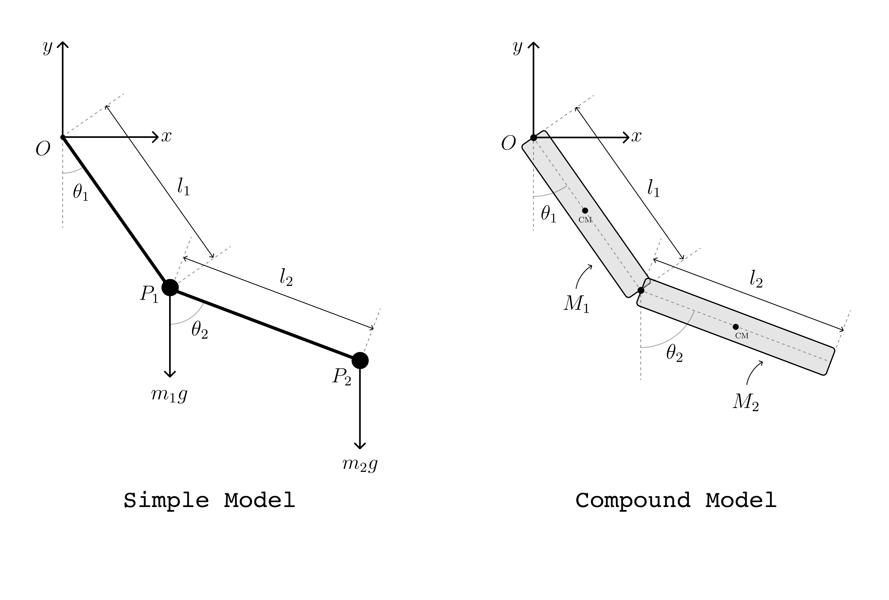
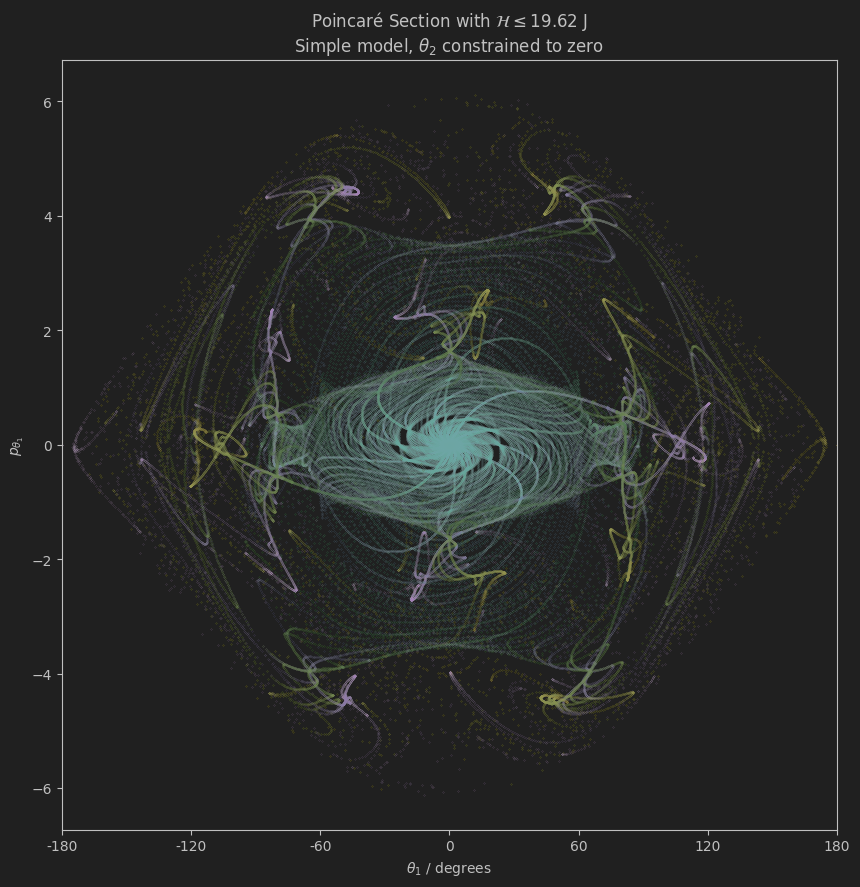
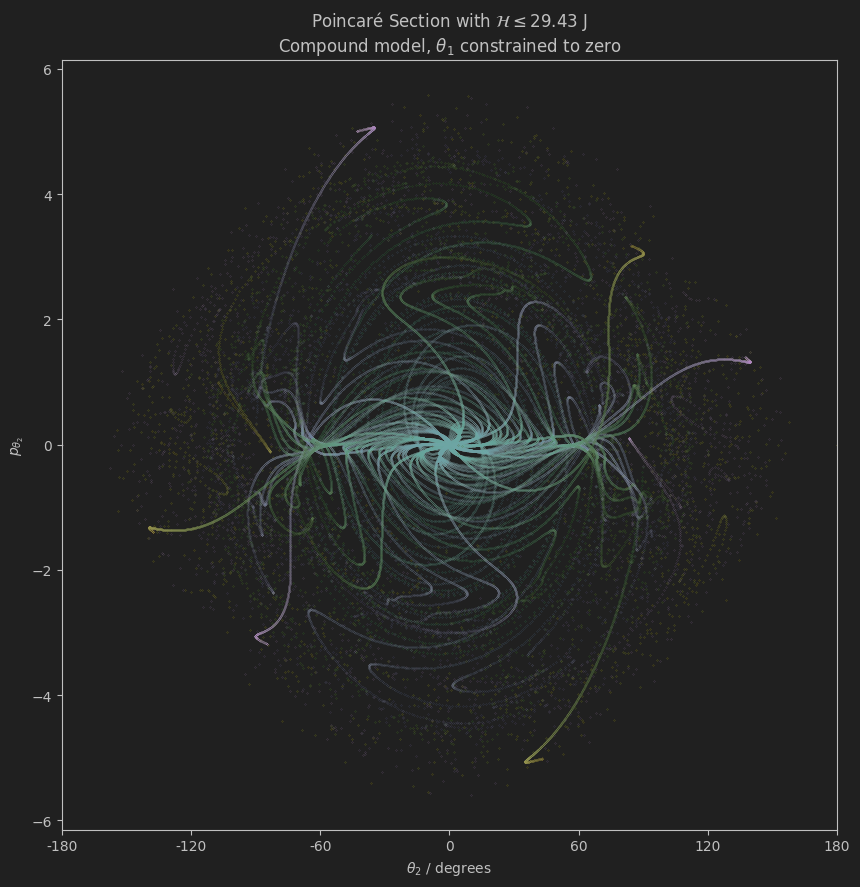

# Extension of the [Double Pendulum App](https://github.com/pineapple-bois/Double_Pendulum_App/tree/main). 

### Development of the `Chaos` page tasks:


1. #### Extend the `DoublePendulum` class to `DoublePendulumSubclass...` capable of instantiating a set of `DoublePendulum` objects, iterating over a range of initial conditions.
   
   - Subclasses will be developed separately, each one responsible for a different feature; Poincaré maps, Lyapunov exponents, Bifurcation diagrams, Data collation etc...
2. #### Write a data dictionary in JSON format of all angles, velocities, momenta and positions.
3. #### Host this data as a PostgreSQL DB on a cloud server (aiming for v.cheap/free).
4. #### Instead of deriving a double pendulum system 'on-the-fly', we will pull data from the database with simple slicing queries.

----

### Pendulum Models



----

### Directory Structure

```
Double_Pendulum_App_Development/
├── BackUps/
├── Images/
├── JSONdata/
├── Notebooks/
│   │   ├── AnalysisData/
│   │   └── DataAnalysisNBs/
│   │       ├── ResourceDataAnalysis.ipynb
│   │       └── TerminationDataAnalysis.ipynb
│   ├── DevelopmentSubClass.ipynb
│   ├── JSONTest.ipynb
│   ├── PoincareEnsemble.ipynb
│   └── PoincareSections.ipynb
├── PendulumModels/
│   ├── DoublePendulumHamiltonian.py
│   └── DoublePendulumLagrangian.py
├── AnalysisFunctions.py
├── DoublePendulumSubclassData.py
├── DoublePendulumSubclassMomenta.py
├── DoublePendulumSubclassRandomEnsemble.py
├── MathFunctions.py
├── README.md
└── requirements.txt
```

----

## 1. The `DoublePendulumExplorer` subclass extends `DoublePendulum`

### a. [`DoublePendulumSubclassMomenta.py`](DoublePendulumSubclassMomenta.py), tested in [`PoincareSections.ipynb`](Notebooks/PoincareSections.ipynb)

#### This subclass aims to plot Poincaré return maps with either $\theta_1$ or $\theta_2$ constrained to zero

Variable declaration:
```python
import sympy as sp

l1, l2, m1, m2, M1, M2, g = sp.symbols('l1 l2 m1 m2 M1 M2 g', real=True, positive=True)

# Declare functions
theta1 = sp.Function('theta1')(t)
theta2 = sp.Function('theta2')(t)
p_theta_1 = sp.Function('p_theta_1')(t)
p_theta_2 = sp.Function('p_theta_2')(t)

# Set Unity Parameters for dimensionless pendulums
params = {
    g: 9.81,  # Acceleration due to gravity (m/s^2)
    l1: 1.0,  # Length of the first rod (m)
    l2: 1.0,  # Length of the second rod (m)
    m1: 1.0,  # Mass of the first bob (kg)
    m2: 1.0,  # Mass of the second bob (kg)
    M1: 1.0,  # Mass of first uniform rod (kg)
    M2: 1.0   # Mass of second uniform rod (kg)
}

# Time vector
stop = 30  # max time in seconds
fps = 800  # frames/second
no_steps = stop * fps

time = [0, stop, no_steps]
```

Instantiation:
```python
simple_explorer = DoublePendulumExplorer(params, time, model='simple', angle_range=(-np.pi, np.pi),
                 fixed_angle='theta1', step_size_degrees=0.5)
```

- Default `angle_range` is $[-\pi, \pi]$
- $V_{\text{max}} \implies \mathcal{H}$ is calculated from the largest absolute value  of `angle_range`
- `fixed_angle` denotes which of $\theta_{1}$ or $\theta_{2}$ to constrain to zero 
- If `step_size_degrees` is set to 1, there will be 360 simulations for `angle_range` $= [-\pi, \pi]$ 


```python
# Integrator Arguments
integrator_args = {
    'rtol': 1e-7,    # default is 1e-3
    'atol': 1e-9     # default is 1e-6
}

# Finding the Poincaré Points
simple_explorer.find_poincare_section(integrator=solve_ivp, fixed_angle=None, analyze=False, **integrator_args)

# Plotting a Poincaré Map
simple_explorer.plot_poincare_map(self, special_angles_deg=None, xrange=(-np.pi, np.pi), yrange=None)
```
If `analyze=True`, we collate computational cost data in .csv format (See [AnalysisFunctions.py](AnalysisFunctions.py))

- Ironically, this analysis increases computational load by about 40% 🤦‍♂️
- This will be extended to collate data on the numerical integration

With looser `rtol` and `atol` defined in `integrator_args`, [`solve_ivp`](https://docs.scipy.org/doc/scipy/reference/generated/scipy.integrate.solve_ivp.html#scipy.integrate.solve_ivp) introduces small errors at each step that accumulate over time, leading to points that are slightly off from their true positions. 

- Tighter tolerances hopefully reduce this drift at the expense of computational load. We want an accurate representation of the system’s dynamics and we want it in a 'reasonable runtime`. These parameters are mutually exclusive

#### Notebook experimentation has aimed to optimise the right combination of parameters. The images below have been produced with:

- 30 second time interval, 800 frames per second $=$ 24,000 integration steps
- 0.125 `step_size_degrees`
- `rtol` $= 10^{-6}$
- `atol` $= 10^{-8}$





#### Batch Processing in `_run_simulations`

Calling `find_poincare_section` calls a private method of the subclass. 

- Batch Size: `run_simulations` allows you to specify the batch_size (currently hardcoded at 80), which determines how many simulations are run in parallel in each batch. 
  - This allows the system to manage CPU and memory usage more effectively, preventing any single batch from consuming too many resources at once.
- Parallel Processing: Within each batch, the simulations are run in parallel using the `joblib.Parallel` and `joblib.delayed` functions. This takes advantage of multiple CPU cores, speeding up the computation by distributing the workload.


----

### b. [`DoublePendulumSubclassRandomEnsemble.py`](DoublePendulumSubclassRandomEnsemble.py), tested in [`PoincareEnsemble.ipynb`](Notebooks/PoincareEnsemble.ipynb)

#### This subclass aims to plot Poincaré return maps with random combinations of $\theta_1$ and $\theta_2$ and is based on a biased Monte Carlo ensemble method.

Considers:

- Introduction of mechanical energy to constrain the system:
- Random sampling
- Optimizing `_solve_ode` for early termination if a simulation diverges

Quantitative analysis of the global system will inform the bias. Initially, it appears that selecting floats in radians completely at random introduces far too much noise.

---

### c. `DoublePendulumSubclassLyapunov`, work in progress ...

----

## 2. [`DevelopmentSubClass.ipynb`](Notebooks/DevelopmentSubClass.ipynb)
   - Have started writing the base methods to collate data.
   - The data dictionaries appear to be quite good!

----

## 3. [`JSONTest.ipynb`](Notebooks/JSONTest.ipynb)
   - Reading in the JSON data using `Pandas` (Will maybe swap for `Polars` once DB launched)

----


### Further Reading and Tools:
- **Books:**
  - "Nonlinear Dynamics and Chaos" by Steven Strogatz
  - "Chaos: An Introduction to Dynamical Systems" by Kathleen T. Alligood, Tim D. Sauer, and James A. Yorke
- **Software Tools:**
  - Check out [`chaospy`](https://chaospy.readthedocs.io/en/master/)
- **Papers:**
  - [Numerical analysis of a Double Pendulum System - Dartmouth](https://math.dartmouth.edu/archive/m53f09/public_html/proj/Roja_writeup.pdf)
  - [The double pendulum: a numerical study - A M Calvão and T J P Penna](https://iopscience-iop-org.libezproxy.open.ac.uk/article/10.1088/0143-0807/36/4/045018)

----
